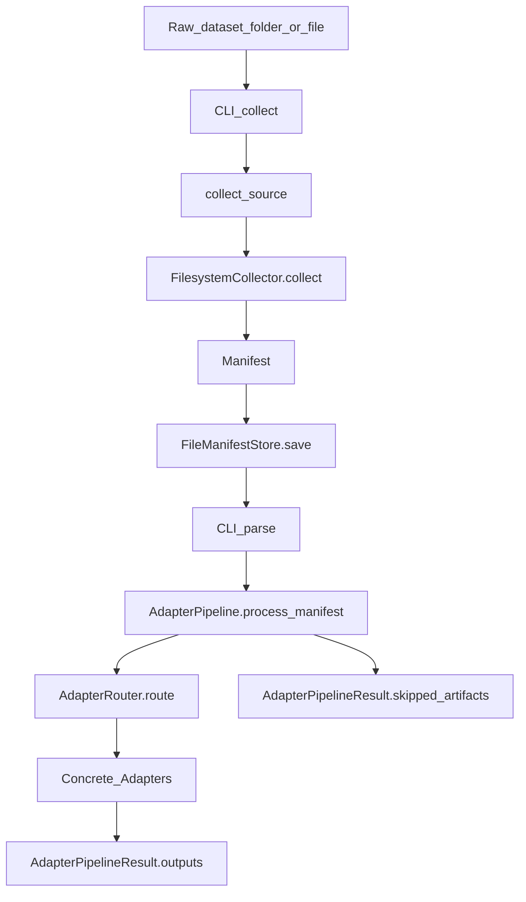

## Workflow: raw dataset → manifests → adapter outputs

This document describes the current Neurolab workflow up to (and including) the **adapter layer**: how raw data is collected into a `Manifest`, then parsed into structured `AdapterOutput` records.

### CLI entry points

- **Collect a dataset (build + store a manifest)**:

```bash
neurolab collect <path>
```

- **Parse a stored manifest through adapters (in-memory)**:

```bash
neurolab parse <manifest_id>
```

- **Optional: persist adapter outputs** (adapter-results storage; still “post-adapter” but useful for inspection):

```bash
neurolab parse <manifest_id> --store-outputs
```

Relevant implementation: `neurolab.interfaces.cli.collect()` and `neurolab.interfaces.cli.parse()` in [`src/neurolab/interfaces/cli.py`](src/neurolab/interfaces/cli.py).

---

### Conceptual layers and what happens in each



#### 1) Raw dataset (files on disk)

Neurolab currently treats a raw dataset as a filesystem path (file or directory). The path is provided via CLI (`neurolab collect <path>`) and becomes `DataSourceSpec.uri`.

#### 2) CLI layer (`neurolab.interfaces.cli`)

- **Collect command** (`collect(path: str)`):
  - Builds a `DataSourceSpec` and calls `collect_source(source)`.
  - Persists the resulting `Manifest` via `FileManifestStore.save(manifest)`.

- **Parse command** (`parse(manifest_id: str, ...)`):
  - Loads a stored manifest via `FileManifestStore.load(manifest_id_or_prefix)`.
  - Runs `AdapterPipeline().process_manifest(manifest)`.
  - Prints a summary: artifacts processed, adapters used, outputs generated, skipped artifacts.
  - Optional: persists outputs via `FileAdapterResultStore.save_pipeline_result(...)` when `--store-outputs` is passed.

Code: [`src/neurolab/interfaces/cli.py`](src/neurolab/interfaces/cli.py).

#### 3) Orchestrator (`neurolab.data_interface.orchestrator`)

The orchestrator selects the appropriate collector based on `DataSourceSpec.source_type`.

- Entry point: `collect_source(source: DataSourceSpec) -> Manifest`
- Current behavior: if `source.source_type == "filesystem"`, uses `FilesystemCollector`.

Code: [`src/neurolab/data_interface/orchestrator.py`](src/neurolab/data_interface/orchestrator.py).

#### 4) Collector (`neurolab.data_interface.collectors`)

The filesystem collector is responsible for **artifact discovery** and **deterministic manifest creation**.

Key steps performed by `FilesystemCollector.collect(source)`:

- Traverses a file or directory (recursive optional).
- Builds one `Artifact` per file, including:
  - `absolute_path` (required by current adapters for deterministic I/O)
  - `relative_path` (stable identity within the dataset root)
  - `size_bytes`, `mtime`, and (optionally) `content_hash`
  - `media_type` inferred from `_MEDIA_BY_EXT` (e.g. `.csv`, `.json`, `.ncs`)
- Sorts artifacts deterministically (`relative_path`).
- Computes `manifest_id` deterministically from the artifact set and returns a `Manifest`.

Code: [`src/neurolab/data_interface/collectors.py`](src/neurolab/data_interface/collectors.py).

#### 5) Models (`neurolab.data_interface.models`)

The workflow passes data between layers using immutable dataclasses:

- `DataSourceSpec`
- `Artifact`
- `Manifest`

Code: [`src/neurolab/data_interface/models.py`](src/neurolab/data_interface/models.py).

#### 6) Manifest storage (`neurolab.storage.manifest_store`)

Manifests are persisted as JSON files (default `~/.neurolab/data/manifests/`).

- `FileManifestStore.save(manifest)` writes `manifest.to_dict()`
- `FileManifestStore.load(manifest_id)` reads JSON and uses `Manifest.from_dict(...)`
- Supports prefix resolution for convenience (unique prefix → full id)

Code: [`src/neurolab/storage/manifest_store.py`](src/neurolab/storage/manifest_store.py).

#### 7) Adapter pipeline (`neurolab.adapters.pipeline`)

`AdapterPipeline.process_manifest(manifest)` orchestrates parsing:

- Sorts artifacts deterministically by `relative_path`.
- For each artifact, calls `AdapterRouter.route(artifact)`:
  - If the router returns outputs, they are appended to `outputs`.
  - If the router returns an empty list, the artifact is recorded in `skipped_artifacts`.
- Returns `AdapterPipelineResult(outputs, skipped_artifacts)`.

Code: [`src/neurolab/adapters/pipeline/adapter_pipeline.py`](src/neurolab/adapters/pipeline/adapter_pipeline.py).

#### 8) Router + registry (`neurolab.adapters.core`)

- `register_adapter(adapter_cls)` stores adapter **classes** (not instances).
- `get_adapters()` returns adapter classes sorted by `priority` (descending).
- `AdapterRouter.route(artifact)` instantiates adapter classes in order and returns the first adapter’s `parse()` outputs, or `[]` if none match.

Code: [`src/neurolab/adapters/core/registry.py`](src/neurolab/adapters/core/registry.py), [`src/neurolab/adapters/core/router.py`](src/neurolab/adapters/core/router.py).

#### 9) Adapter contract + outputs (`neurolab.adapters.core`)

All adapters implement:

- `can_handle(artifact: Artifact) -> bool` (format-only matching: media_type / extension)
- `parse(artifact: Artifact) -> list[AdapterOutput]`

Each `AdapterOutput` contains:

- `artifact_id`, `adapter_name`, `adapter_version`
- `dataset_type` (structural hint only, e.g. `tabular`, `timeseries`)
- `schema` (adapter-specific structured metadata)
- `payload` (adapter-specific parsed data; flexible by design)

Code: [`src/neurolab/adapters/core/base.py`](src/neurolab/adapters/core/base.py), [`src/neurolab/adapters/core/output.py`](src/neurolab/adapters/core/output.py).

#### 10) Persisted adapter outputs (`neurolab.storage.adapter_results`)

When using `neurolab parse <manifest_id> --store-outputs`, each row is written under:

`~/.neurolab/data/adapter_outputs/{manifest_id}/{provenance_id}/`

Two IDs separate **content** from **lineage**:

- **`data_hash`**: SHA-256 of the canonical standardized payload (same decoded adapter output ⇒ same hash, regardless of which adapter produced it).
- **`provenance_id`**: SHA-256 of canonical provenance metadata (e.g. `manifest_id`, artifact path key, raw `content_hash`, adapter name/version, schema fingerprint, pipeline ordinal, optional `adapter_config_hash`). This is the **directory name** and stable record key for the Analysis Hub / CLI.

`meta.json` records both, plus fields such as `artifact_id`, `schema`, `created_at`, and payload location. Older `meta.json` files without `meta_schema_version` / `provenance_id` are still loaded as legacy v1 (single legacy id mapped to both concepts).

Code: [`src/neurolab/storage/adapter_results/file_store.py`](src/neurolab/storage/adapter_results/file_store.py), [`src/neurolab/storage/adapter_results/ids.py`](src/neurolab/storage/adapter_results/ids.py), [`src/neurolab/storage/adapter_results/models.py`](src/neurolab/storage/adapter_results/models.py). Analysis Hub: [`src/neurolab/analysis_hub/filesystem.py`](src/neurolab/analysis_hub/filesystem.py).

---

### Current adapter implementations

- **CSV** (`text/csv` / `.csv`): [`src/neurolab/adapters/implementations/tabular/csv_adapter.py`](src/neurolab/adapters/implementations/tabular/csv_adapter.py)
- **JSON** (`application/json` / `.json`): [`src/neurolab/adapters/implementations/tabular/json_adapter.py`](src/neurolab/adapters/implementations/tabular/json_adapter.py)
- **Neuralynx NCS** (`application/x-neuralynx-ncs` / `.ncs`): [`src/neurolab/adapters/implementations/neo/ncs_adapter.py`](src/neurolab/adapters/implementations/neo/ncs_adapter.py)

Registration happens at import time in [`src/neurolab/adapters/implementations/__init__.py`](src/neurolab/adapters/implementations/__init__.py), which is imported from the adapter package root.

---

### Test coverage checklist (implemented)

- **Data interface / collectors**
  - [x] Models round-trip (`to_dict`/`from_dict`)
  - [x] Hashing (file + manifest id)
  - [x] `FilesystemCollector` discovery rules and determinism

See `tests/data_interface/unit/` and `tests/data_interface/integration/`.

- **Storage**
  - [x] `FileManifestStore` save/load/list/delete and prefix resolution

See `tests/storage/unit/test_manifest_store.py`.

- **Adapter core + pipeline**
  - [x] `AdapterOutput` construction + immutability
  - [x] Registry returns classes + priority ordering
  - [x] Router returns list outputs and handles “no match”
  - [x] Pipeline returns outputs + skipped_artifacts with deterministic artifact ordering

See `tests/adapters/unit/` (core/pipeline tests).

- **Concrete adapters**
  - [x] CSV adapter: can_handle + parse + error cases
  - [x] JSON adapter: can_handle + parse + error cases
  - [x] NCS adapter: can_handle + parse error cases (requires real .ncs fixture for full success parse test)

See `tests/adapters/unit/test_csv_adapter.py`, `test_json_adapter.py`, `test_ncs_adapter.py`.

- **CLI**
  - [x] `neurolab collect` basic success behavior
  - [x] `neurolab parse` basic success behavior

See `tests/interfaces/test_cli.py`.

